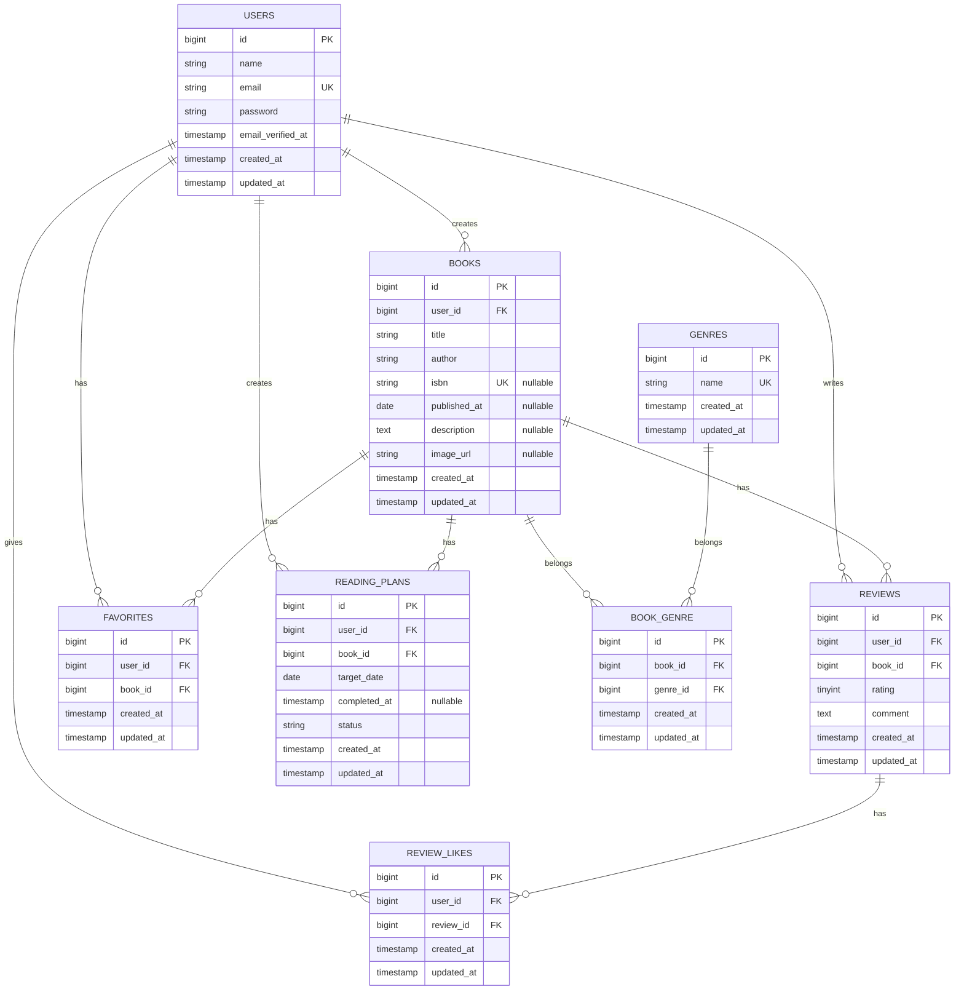

# BookShelf 書籍レビューアプリ

## 概要

BookShelfは、書籍情報を登録・管理し、レビューやお気に入り、ランキング、読書計画などを利用できる書籍レビューアプリです。

書籍の基本的なCRUD機能に加えて、ISBNによる書籍情報取得、検索・絞り込み・ソート、レビュー、いいね、お気に入り、読書レポート、読書計画、リマインダー通知、REST APIなどを実装しています。

## 主な機能

- ユーザー登録・ログイン・ログアウト
- 書籍一覧・詳細表示
- 書籍登録・編集・削除
- ISBNによるGoogle Books APIからの書籍情報取得
- タイトル・著者名によるキーワード検索
- ジャンルによる絞り込み
- 新着順・古い順・タイトル順・平均評価順のソート
- ジャンル管理
- レビュー投稿・編集・削除
- レビューへのいいね
- お気に入り登録・解除
- お気に入り一覧
- 平均評価によるランキング
- マイ読書レポート
- 読書計画の登録・編集・削除
- 読了状態の管理
- 読書計画の期限超過自動更新
- 読書計画のリマインダー通知
- Laravel Sanctumを利用したREST API
- Seederによる動作確認用ダミーデータ
- Feature Test / Unit Test

## 使用技術

| 技術 | 内容 |
| --- | --- |
| PHP | 8.5 |
| Laravel | 12.68.0 |
| MySQL | 8.4 |
| Laravel Sail | Docker開発環境 |
| Docker / Docker Compose | コンテナ環境 |
| Laravel Fortify | Web認証 |
| Laravel Sanctum | API認証 |
| Blade | テンプレートエンジン |
| Tailwind CSS | CSSフレームワーク |
| Alpine.js | フロントエンド処理 |
| Google Books API | ISBNによる書籍情報取得 |
| PHPUnit | Unit / Feature Test |
| Laravel Pint | コードフォーマット |
| phpMyAdmin | データベース管理 |

## ER図



Laravel標準機能として、上記以外に以下のテーブルも使用します。

- `notifications`
- `personal_access_tokens`
- `password_reset_tokens`
- `failed_jobs`

## 環境構築

### 前提環境

以下が利用できる環境を想定しています。

- Git
- Docker
- Docker Compose

### 1. リポジトリをclone

```bash
git clone https://github.com/ks8810as5086-ui/bookshelf-app.git
cd bookshelf-app
```

### 2. Composerパッケージをインストール

初回はLaravel Sail自体がまだ `vendor` に存在しないため、Composer用Dockerイメージを利用して依存関係をインストールします。

```bash
docker run --rm \
    -u "$(id -u):$(id -g)" \
    -v "$(pwd):/var/www/html" \
    -w /var/www/html \
    laravelsail/php85-composer:latest \
    composer install --ignore-platform-reqs
```

ローカル環境にPHPとComposerがインストールされている場合は、以下でも構いません。

```bash
composer install
```

### 3. `.env` を作成

```bash
cp .env.example .env
```

`.env` のデータベース設定を以下のようにしてください。

```env
APP_NAME=BookShelf
APP_ENV=local
APP_DEBUG=true
APP_URL=http://localhost

DB_CONNECTION=mysql
DB_HOST=mysql
DB_PORT=3306
DB_DATABASE=laravel
DB_USERNAME=root
DB_PASSWORD=
```

### 4. Laravel Sailを起動

```bash
./vendor/bin/sail up -d
```

以降、本READMEではLaravel Sailを `sail` と表記しています。

シェルにaliasを設定していない場合は、

```bash
./vendor/bin/sail
```

に読み替えてください。

### 5. APP_KEYを生成

```bash
sail artisan key:generate
```

### 6. Migration / Seederを実行

```bash
sail artisan migrate:fresh --seed
```

Seederにより、ユーザー・ジャンル・書籍・レビュー・お気に入り・レビューいいね・読書計画の動作確認用データが投入されます。

### 7. npmパッケージをインストール

```bash
sail npm install
```

### 8. Viteを起動

```bash
sail npm run dev
```

### 9. アプリへアクセス

ブラウザから以下へアクセスしてください。

- アプリケーション
  http://localhost

- phpMyAdmin
  http://localhost:8080

## 動作確認用ユーザー

Seeder実行後、以下のユーザーでログインできます。

| 名前 | メールアドレス | パスワード |
| --- | --- | --- |
| 山田太郎 | yamada@example.com | password |
| 鈴木花子 | suzuki@example.com | password |
| 田中一郎 | tanaka@example.com | password |
| 佐藤美咲 | sato@example.com | password |
| 高橋健太 | takahashi@example.com | password |

主要な読書計画の動作確認データは、主に山田太郎のアカウントへ設定しています。

## Seeder

以下のSeederを使用しています。

1. `UserSeeder`
2. `GenreSeeder`
3. `BookSeeder`
4. `ReviewSeeder`
5. `FavoriteSeeder`
6. `ReviewLikeSeeder`
7. `ReadingPlanSeeder`

まとめて実行する場合：

```bash
sail artisan db:seed
```

データベースを初期化してSeederまで実行する場合：

```bash
sail artisan migrate:fresh --seed
```

## Google Books API

書籍登録時のISBN検索では、Google Books APIを使用しています。

ISBNを指定すると、以下の情報を取得します。

- タイトル
- 著者名
- 出版日
- 説明
- 画像URL

現在の実装ではAPIキーの追加設定は不要です。

## APIエンドポイント

APIのベースURL：

```text
http://localhost/api/v1
```

| Method | Endpoint | 認証 | 概要 |
| --- | --- | --- | --- |
| GET | `/api/user` | Sanctum必須 | 認証ユーザー情報取得 |
| GET | `/api/v1/books` | 不要 | 書籍一覧取得 |
| GET | `/api/v1/books/{book}` | 不要 | 書籍詳細取得 |
| POST | `/api/v1/books` | Sanctum必須 | 書籍登録 |
| PUT | `/api/v1/books/{book}` | Sanctum必須 | 書籍更新 |
| DELETE | `/api/v1/books/{book}` | Sanctum必須 | 書籍削除 |

### 書籍一覧API

```text
GET /api/v1/books
```

以下のクエリパラメータを利用できます。

| パラメータ | 内容 |
| --- | --- |
| `keyword` | タイトル・著者名検索 |
| `genre_id` | ジャンルID |
| `page` | ページ番号 |
| `per_page` | 1ページあたりの件数 |

### API認証

書き込み系APIではLaravel SanctumのBearer Token認証を使用します。

動作確認用トークンはTinkerから作成できます。

```bash
sail artisan tinker
```

例：

```php
$user = App\Models\User::where('email', 'yamada@example.com')->first();
$token = $user->createToken('test-token')->plainTextToken;
$token;
```

取得したトークンを以下の形式でAuthorizationヘッダへ設定します。

```text
Authorization: Bearer {token}
```

例：

```bash
curl -H "Accept: application/json" \
     -H "Authorization: Bearer {token}" \
     http://localhost/api/user
```

## 読書計画

ログインユーザーは書籍ごとに読書計画を作成できます。

読書計画には以下の状態があります。

- `planned`：読書予定
- `completed`：読了
- `overdue`：期限超過

読書計画一覧では状態による絞り込みも可能です。

## リマインダー通知

読書計画の期日に応じて通知を作成します。

主な通知タイミング：

- 読了予定日の3日前
- 読了予定日当日
- 読了予定日の3日後

同一条件の通知は重複して作成されません。

読了済みの読書計画は通知対象外です。

## Scheduler

以下の2つのコマンドを毎日9:00に実行する設定です。

```text
app:update-overdue-reading-plans
app:send-reading-plan-reminders
```

登録状況は以下で確認できます。

```bash
sail artisan schedule:list
```

開発環境でSchedulerを継続実行する場合：

```bash
sail artisan schedule:work
```

本番環境では、Laravel Schedulerを毎分実行するcron等の設定が必要です。

## テスト

全テストを実行します。

```bash
sail artisan test
```

最終確認時点：

```text
114 passed
291 assertions
```

### Laravel Pint

コードフォーマットを確認・修正します。

```bash
sail bin pint
```

### Composer Audit

依存パッケージの脆弱性を確認します。

```bash
sail composer audit
```

最終確認時点では、既知のセキュリティ脆弱性は検出されていません。

## 主な確認コマンド

```bash
sail artisan migrate:fresh --seed
sail artisan test
sail bin pint
sail composer audit
sail artisan route:list
sail artisan schedule:list
```

## 開発環境URL

| サービス | URL |
| --- | --- |
| BookShelf | http://localhost |
| phpMyAdmin | http://localhost:8080 |
| Vite | http://localhost:5173 |

## 作成者

西海　顕一郎
